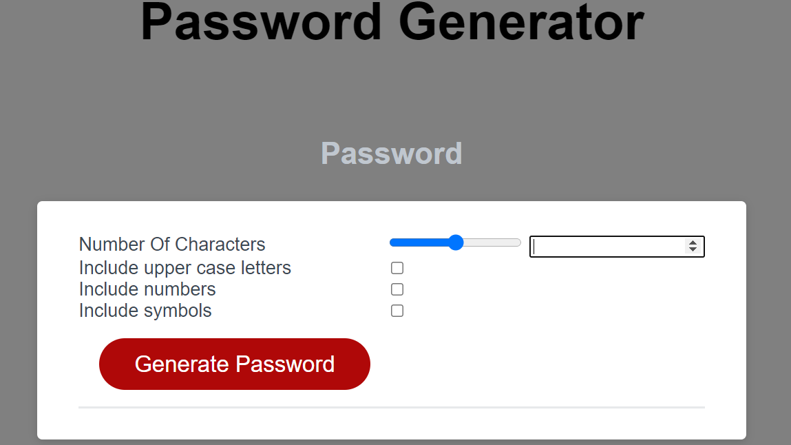
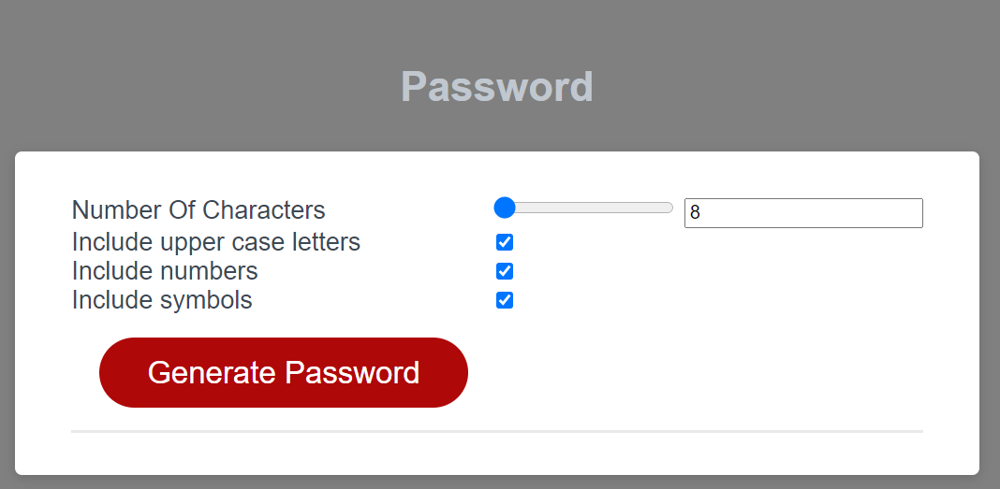
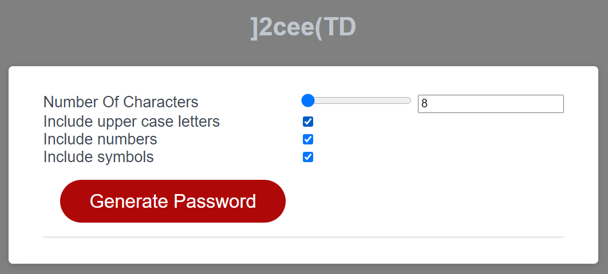

# Password generators
You can view my repository from github here - https://github.com/anhcu/hw-3-password  
My live page - https://anhcu.github.io/hw-3-password/

# Description
Password generators help a user come up with a unique password with all the needed criteria.

# Motivation
My motivation to come up with an app takes out all the thinking to come up with a unique password.

## Unique password criteria must include the following:
1. Alphabetic characters upper and lower case.
2. Numeric characters ranging from 0 - 9
3. The punctuation special characters.
4. A dedicated series of characters made up of numbers or special characters or Alphabetic upper and lower case.

# Instructions
1. Enter your desired number of passwords.
2. Check boxes that you want to include in your password.  
** ie. upper case, numbers or symbols.
3. Last step is to click on "Generator Password."

